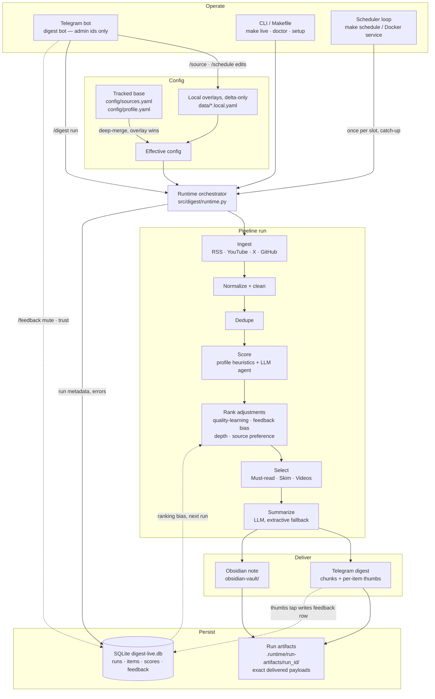

# AI Daily Digest Architecture (Current)

## Document Status
- Status: Current architecture baseline
- Updated: 2026-08-01
- Source of truth alignment: `README.md`, `src/digest/*`, `compose.yaml`

## System Overview
AI Daily Digest is a Python runtime operated through a Telegram bot and the CLI/Makefile - there is no web console and no network API. It ingests configured AI content sources, executes a scoring/summarization pipeline, delivers outputs to Telegram and Obsidian, and persists run data in SQLite for observability.

Dashed lines are the learning loop: item thumbs taps and `/feedback` commands write feedback rows to SQLite, which feed ranking bias in the next run's rank-adjustment stage.

## Runtime Entry Points
- `digest run`: manual execution, full pipeline.
- `digest schedule`: schedule loop with timezone/time target.
- `digest doctor`: onboarding/preflight verification checks.
- `digest bot`: Telegram admin command loop.
- `digest bot-health-check`: validates bot heartbeat artifact.

## Component Responsibilities
- `src/digest/connectors/*`
  - External source fetch and source-specific parsing.
- `src/digest/pipeline/*`
  - Canonical item normalization, dedupe, scoring orchestration, selection, summarization prep.
- `src/digest/scorers/agent.py`
  - Agentic scoring/tagging via OpenAI Responses API with retries and controls.
- `src/digest/summarizers/*`
  - LLM summarization path plus extractive fallback path.
- `src/digest/quality/online_repair.py`
  - Must-read quality repair stage with fail-open behavior controls.
- `src/digest/delivery/*`
  - Telegram rendering/sending and Obsidian note writing.
- `src/digest/ops/*`
  - Onboarding, source/profile registries, run lock, Telegram commands, paste-a-link source detection (`ingest_detect.py`).
- `src/digest/storage/sqlite_store.py`
  - Persistence for runs, scoring artifacts, diagnostics, and observability feeds.

## Primary Data Flows

### Flow: Live Run
1. Runtime loads effective sources/profile from base config + local overlays.
2. Connectors fetch candidates from all configured source groups.
3. Pipeline normalizes and deduplicates items.
4. Scoring combines profile heuristics and optional agent scoring.
5. Ranking applies quality-learning, feedback bias, content-depth, source-preference, and research-balance adjustments.
6. Selection computes `Must-read`, `Skim`, and `Videos`.
7. Summarization executes LLM/extractive paths with guardrails.
8. Delivery sends Telegram digest and writes Obsidian note.
9. Store persists run metadata, selected items, archived artifacts, errors, and observability events.

### Flow: Digest Review and Feedback
1. Archived run artifacts and selected items are persisted to SQLite and `.runtime/run-artifacts/<run_id>/` (delivered Telegram chunks and the rendered Obsidian note) for non-preview runs.
2. Operators inspect run outcomes through Telegram (`/status`, `/history`, `/doctor`) or by reading the archived files/logs directly.
3. Item-level feedback comes from the thumbs-up/down inline buttons attached to each delivered digest chunk; a tap writes a feedback row (rating 5 or 1, `target_kind="item"`) via the bot's `fb:` callback handler.
4. Source-level feedback (`mute`/`trust`) is submitted through the Telegram `/feedback` command; feedback is stored with derived feature rows and later reused as ranking bias in runtime.

### Flow: Onboarding
1. `make setup` installs dependencies and creates local overlay files.
2. Preflight checks (`make doctor` or the Telegram `/doctor` command) validate env, config, and runtime prerequisites.
3. Sources are configured through `data/sources.local.yaml` or the Telegram `/source` command.
4. `make live` (or the Telegram `/digest run` command) executes a live run against the configured sources.

## State and Storage Model
- Base tracked config:
  - `config/sources.yaml`
  - `config/profile.yaml`
- Local mutable overlays:
  - `data/sources.local.yaml`
  - `data/profile.local.yaml`
- Runtime and output artifacts:
  - `digest-live.db`
  - `logs/digest.log`
  - `.runtime/run-artifacts/<run_id>/*`
  - `.runtime/*` (locks, bot heartbeat, `schedule-state.json` slot marker)
  - `obsidian-vault/` notes

## Reliability and Observability
- Run lock prevents overlapping conflicting runs.
- Structured JSON logging includes run/stage metadata.
- Run history, selected-item records, and feedback are persisted in SQLite; delivered Telegram/Obsidian artifacts are archived under `.runtime/run-artifacts/<run_id>/` for non-preview runs.
- Bot runtime heartbeat (`.runtime/bot-health.json`) supports the `digest-bot` Docker healthcheck via `digest bot-health-check`; the `digest-scheduler` service runs the schedule loop directly and has no healthcheck (there is no `/api/health` or any other network endpoint in this system).
- Selected-item records preserve raw score, adjusted score, and adjustment breakdown for later inspection via SQLite or the archived run artifacts.

## Deployment Topologies
- CLI automation mode:
  - `make schedule` runs the CLI scheduler loop, driven by `profile.schedule` (the settings the Telegram `/schedule` commands edit): cadence, local time, quiet hours, timezone, exactly-once per slot with same-day catch-up via `.runtime/schedule-state.json`.
- Background scheduler service mode:
  - `make docker-scheduler-up` runs a detached Docker service running `digest schedule` for always-on scheduling.
  - `make docker-scheduler-deploy` rebuilds and recreates that service after local code changes.
- Bot runtime mode:
  - `digest bot` directly or Docker Compose managed service.
- Default Docker operator stack mode:
  - `make docker-up` starts both `digest-bot` and `digest-scheduler`.
  - Docker exports `OBSIDIAN_VAULT_PATH=/app/obsidian-vault` so Obsidian delivery lands in the mounted host vault.

## Architectural Requirements

### Requirement: Config Overlay Safety
The architecture SHALL preserve tracked baseline config and isolate mutable runtime edits in overlay files.

#### Scenario: Runtime source edit
- GIVEN an operator adds a source via a Telegram bot command
- WHEN mutation is persisted
- THEN tracked `config/sources.yaml` remains unchanged
- AND delta is written to `data/sources.local.yaml`

### Requirement: Observable Execution
The architecture SHALL persist enough event/run data to diagnose failures without rerunning workloads.

#### Scenario: Source failure diagnosis
- GIVEN a run completes with source errors
- WHEN the operator checks `logs/digest.log`, the Telegram `/history` command, or queries the SQLite `runs` table
- THEN failing source, last error, and run linkage are available

### Requirement: Delivered Artifact Persistence
The architecture SHALL preserve exact delivered artifacts for non-preview runs.

#### Scenario: Archived digest retrieval
- GIVEN a completed non-preview run
- WHEN an operator requests archived run artifacts
- THEN the system can return the exact Telegram payload and Obsidian note written for that run
- AND the archive survives container restarts through mounted runtime storage

### Requirement: Ranking Transparency
The architecture SHALL separate raw scoring from post-score ranking adjustments.

#### Scenario: Adjusted score review
- GIVEN a selected run item
- WHEN the operator queries the SQLite `run_selected_items` table or the archived run artifacts
- THEN raw score, adjusted score, and adjustment breakdown are available
- AND the user-facing digest score reflects the adjusted score rather than raw score alone

### Requirement: No Network Control Plane
The architecture SHALL NOT expose a network-reachable control plane. The only remote-accessible surface is the Telegram bot, and it SHALL be restricted to configured admin chat and user ids.

#### Scenario: Unauthorized Telegram sender
- GIVEN a Telegram update arrives from a chat id or user id not present in `TELEGRAM_ADMIN_CHAT_IDS` / `TELEGRAM_ADMIN_USER_IDS`
- WHEN the bot processes the update
- THEN the bot replies "Not authorized."
- AND no config mutation or run trigger is applied
